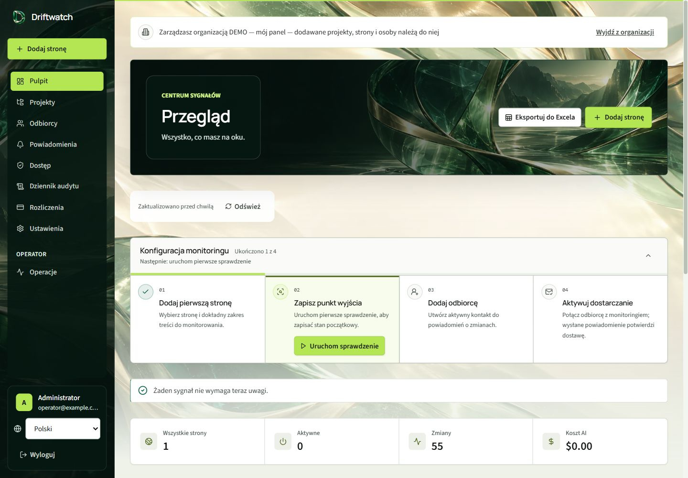

# Driftwatch


Driftwatch is a **self-hosted web change monitor**, started as an internal tool
and shared as a portfolio project. It watches selected parts of web pages,
records meaningful changes and keeps the evidence needed to understand each
result. Chromium captures the page; structured comparison detects changes;
optional AI adds a summary and significance verdict. Monitoring works without
an OpenAI key or a paid subscription.

**License: noncommercial use only.** This public portfolio project uses
[PolyForm Noncommercial 1.0.0](LICENSE). Commercial use requires separate written
permission from the copyright holder. See [licensing](#license).

The core workflow is **capture → normalize → compare → record → optionally analyze
→ deliver**. A failed capture does not replace the previous baseline. A first
successful capture establishes a baseline rather than inventing a change.



[Interface gallery](docs/screenshots/README.md) shows the desktop and mobile UI
from an isolated instance with synthetic data and scripted capture, AI and
delivery adapters. The [brand kit](brand-kit/README.pl.md) preserves artwork
originals, concise generation provenance and optional export recipes. Body and
display fonts are served locally; their upstream sources and licenses are included in
[web/public/fonts](web/public/fonts).

## Quick start with Docker

Requirements: Docker Desktop with Linux containers (or Docker Engine + Compose),
Python 3.12 or newer for the configuration helper, and at least 10 GB of free disk
space for images, Chromium and build cache. The native image is validated on
**Linux x86_64**. From a downloaded or cloned checkout:

```sh
python scripts/bootstrap_env.py
docker compose up --build -d
```

The helper creates three independent random keys in an ignored `.env` and enables
one-time initial setup. It refuses to replace an existing file. The first build
downloads dependencies and compiles native browser fixes, so it can take several
minutes.

Open **http://localhost:8000** and register your account. On a fresh installation,
the first successful registration becomes the instance administrator/operator.
Further registration is closed by default; invite additional users from the
panel. Each downloaded instance has its own database and its own first owner.
An existing database keeps its accounts and permissions. See
[first-account setup](docs/INSTALL.md#first-account-and-registration) for
concurrency, recovery and the optional seeded administrator.

After signing in, enroll TOTP and save the recovery codes when prompted. Open
**Organizations → Manage** for your default workspace. Its first owner is also
its administrator, so normal monitoring there does not require a support grant.

The reference stack publishes port 8000 to loopback only. Sharing the source on
GitHub does not require exposing your running instance. Before exposing a host,
set the real HTTPS base URL and follow [deployment instructions](docs/DEPLOY.md).

For your first monitor, choose a public URL and a stable CSS selector, select
**AI disabled**, and use **Every change** notifications. The first check becomes
the baseline; the next content change appears in history. With no recipients,
you can still inspect the stored changes. [Installation](docs/INSTALL.md) includes
Windows/Linux source setup, PostgreSQL and updating an existing instance.

## What to inspect in this project

The backend uses Python, FastAPI, async SQLAlchemy and Alembic with SQLite or
PostgreSQL. The frontend uses React, TypeScript and Vite; Playwright supplies the
browser. These are the main design decisions to review:

- [Monitoring semantics](docs/MONITORING_SEMANTICS.md): ordered content, noisy
  attributes, selectors, failed captures, linked documents and known limitations.
- [Deterministic demo](docs/DEMO.md): baseline, noise, failure, recovery and
  monitoring without AI, using owned fixtures and no paid providers.
- [Architecture](docs/ARCHITECTURE.md) and [database queue decision](docs/adr/002-db-queue.md):
  boundaries, durable jobs, leases, retries and crash recovery.
- [AI boundary](docs/adr/003-ai-boundary.md): provider input, prompt injection,
  validation, immutable analysis provenance and unknown cost reporting.
- [Tests](tests): controlled-time lease loss, retry exhaustion, transaction
  concurrency, tenant authorization, real browser capture and failure behavior.
- [CI](.github/workflows/ci.yml): Python 3.12 on Windows/Linux, locked dependencies,
  lint/types/tests, Chromium, PostgreSQL, frontend checks, image audits and a
  Docker API-to-worker smoke test with socket-level egress assertions.

## Product capabilities

The UI provides projects, selectors, change history, recipient routing, optional
AI rules, mail/webhooks and an Operations view. English and Polish, five color
palettes and tenant branding are included. Changes remain visible when analysis
or delivery fails; unresolved work is retained for recovery. The history keeps
previous verdicts and the model/rules/input metadata for each actual AI run.

Organizations, roles, invitations, TOTP and audited operator support grants keep
workspaces separate. The first owner can run a personal workspace; organizations
also support separate teams. Billing is a retained optional module, disabled by
default; self-hosted monitoring does not require it. The visual selector picker
is disabled in the reference Compose deployment; manual selectors work with the
isolated worker.

## Reliability and limits

Checks and notifications use database-backed leases and bounded retry budgets.
Expired owners cannot save stale results. A crash after a provider accepted an
email and before the transaction records it may still cause a duplicate: delivery
is **at least once**, not exactly once. An exhausted job needs an operator review
and an audited redrive. [Recovery](docs/RECOVERY.md) describes these states.

The reference deployment separates application data from the browser. The
unprivileged browser shares a namespace with a small firewall sidecar that has
only `NET_ADMIN`; it cannot initiate connections to private, loopback, link-local,
CGNAT or metadata destinations. Docker's embedded DNS is a narrow resolver
exception. IPv6 browser egress is currently disabled. Other hosting platforms
must supply an equivalent tested packet policy. In-process development capture
has no such isolation. See [Security](SECURITY.md) for the remaining boundaries.

Dynamic pages, anti-bot measures, authenticated pages and unstable selectors can
still prevent capture. This is not a semantic understanding engine: the chosen
region and comparison policy define what a change means. AI classification is
optional and may be wrong. Unknown model pricing is reported as unknown.

## Documentation

- [Install and update](docs/INSTALL.md), [FAQ](docs/FAQ.md), [Deploy](docs/DEPLOY.md)
- User guide: [English](docs/USER_GUIDE.en.md), [Polski](docs/USER_GUIDE.pl.md)
- Administrator guide: [English](docs/ADMIN_GUIDE.en.md), [Polski](docs/ADMIN_GUIDE.pl.md)
- [Backup, restore and recovery](docs/RECOVERY.md), [Contributing](CONTRIBUTING.md)
- [Security and secret scanning](SECURITY.md), [documentation index](docs/README.md)

## License

[PolyForm Noncommercial 1.0.0](LICENSE) permits noncommercial use, modification
and redistribution under its terms. Commercial use of Driftwatch is not granted;
contact the copyright holder through [GitHub](https://github.com/mtpiotrowski1-pixel)
to request separate written permission. Public source availability does not make
this an OSI-approved open-source license.

Dependencies, bundled fonts and attributed native patches retain their own
licenses; see [third-party notices](THIRD_PARTY_NOTICES.md). The Docker API image
also includes the exact source archive at `/driftwatch-source.tar.gz` for inspection.
