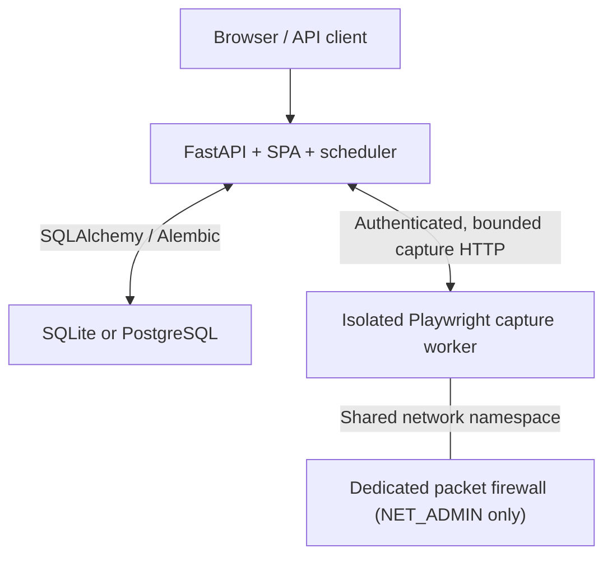

# Architecture

## Shape of the system

Driftwatch has two application runtime targets, a firewall target and one durable database:



The API process serves the JSON API and built React SPA. Its scheduler reserves
work in a database-backed queue, claims jobs with leases, composes capture,
analysis, and durable delivery, and can recover abandoned work after a crash.
There is no external message broker. Multiple schedulers can coordinate through
the database primitives, but the number of replicas and capacity still have to
be validated for the deployment.

Public deployments use a separate browser-only image. The capture worker has no
database, OpenAI, mail, session, encryption, or billing credentials. It accepts
an authenticated, size-limited request and returns bounded raw captured HTML.
An approved interaction can carry ephemeral fill plaintext for its approved
origin. The application pipeline removes reflected fill values before persistence,
diff and provider input; the worker result itself is not guaranteed redacted.
In-process capture is a local compatibility path and is refused on a public
deployment unless explicitly enabled.

The reference Compose worker shares a network namespace with a small firewall
sidecar. The sidecar owns packet filtering and receives no credentials; only it
has `NET_ADMIN`. Chromium stays non-root, read-only and without capabilities.
Connection-time rules reject private/loopback/link-local/CGNAT/metadata traffic,
including re-resolution, redirects, WebSockets and browser-discovered hosts.
Docker's embedded resolver is explicitly allowed; IPv6 egress is disabled.
Other platforms must provide an equivalent tested packet policy. Application
DNS/URL checks alone do not establish that boundary. API-originated HTTP/mail
traffic uses separate pinned clients and still needs an appropriate host policy.

## Layers

```text
api/              HTTP edge, dependencies, scope, origin and body guards
billing/          provider boundary, Stripe adapter, event projection/reconcile
security/         passwords, tokens, TOTP, crypto, URL and secret handling
check_queue.py    durable enqueue, reservation, lease, retry and fairness
runner.py         check use-case orchestration
monitoring/       extraction, diffing, browser/network policy and capture clients
notifications/    rendering, channels and transactional outbox delivery
scheduler.py      periodic enqueue, claims, retries, retention and expiry sweeps
models.py db.py   schema, isolation hook, migrations and database operations
```

The dependency direction points from HTTP and scheduling into domain services.
`monitoring/` does not know about HTTP or email. Provider-facing behavior is
behind protocols, allowing tests to use scripted browser, model, billing, and
delivery fakes without reaching external services.

The HTTP database dependency uses FastAPI's
[function scope](https://fastapi.tiangolo.com/tutorial/dependencies/dependencies-with-yield/#early-exit-and-scope).
Response data is serialized before the session closes; its commit completes
before response headers or session cookies reach the client. A failed commit
rolls back and produces an error rather than an acknowledged write. Routes that
cross an external side-effect boundary still commit explicitly at that boundary.
There are no session-backed streaming responses: file downloads use completed
files, and backup downloads persist the audit event before serving the file.
Raw ASGI regression tests inspect a separate database connection at
`http.response.start` and exercise commit failure followed by a successful retry.

## Frontend boundaries

`web/src/pages/Settings.tsx` owns the page loading state and the one-time MFA
recovery result. Enrollment can replace the visible workspace, so that result
stays above the replacement boundary until the user acknowledges saving it.
`web/src/features/settings/` contains the configuration, account, operations,
and usage views. Configuration sections share one `useSettingsDraft` instance;
`model.ts` builds the changed-field payload and parses stored lists without UI
dependencies. Failed saves retain the draft, sensitive changes require step-up,
and successful saves discard entered secrets. Field controls preserve the
explicit-focus behavior that prevents password managers from changing settings.

`web/src/lib/queries.ts` is the stable public import facade for query hooks.
Implementations live under `web/src/lib/queries/`: `auth`, `monitoring`,
`notifications`, `settings`, `access`, `organizations`, `billing`, and
`operations`. These modules import shared cache keys and request-context guards
directly; they never import the facade. Keeping the dependency direction one-way
avoids circular initialization and preserves existing consumer imports.
Session replacement clears tenant data while retaining public capability and
catalog queries. The shared `sensitive-mutation` observer keeps passwords,
TOTP material, and configuration secrets out of TanStack's shared mutation cache.

Frontend tests cover the settings save/error/retry and navigation behavior,
MFA recovery across enrollment, session replacement, tenant context changes,
and sensitive mutation storage. These are behavioral contracts, rather than
assertions about how many components or files implement them.

## Monitoring and delivery flow

1. The scheduler selects due sites from active organizations and reserves a
   durable `SiteCheckJob` with an idempotency key and queue capacity checks.
2. A claimant acquires a lease. An active-job uniqueness constraint prevents two
   live jobs for the same site.
3. Capture runs through the isolated worker, with a hard per-site budget.
4. The pipeline stores a baseline or a content change. A baseline, unchanged
   capture or AI-disabled monitor makes no model call. Eligible changes claim
   analysis ownership and reserve quota transactionally before provider work.
5. A notification intent and destination rows are written to the transactional
   outbox before an external provider is called.
6. Each destination has its own idempotency key, lease, attempt count, retry time,
   sent state, and terminal failed state. Partial success does not mark another
   destination as delivered.
7. Operations aggregates queue, delivery, account-email, scheduler, database,
   worker, storage, and maintenance state. Dead jobs, failed deliveries, recent
   terminal account-email failures, or stale account-email work degrade platform
   state.

Suspending an organization prevents new scheduled and manual work. A billing
suspension is tracked separately from an operator's manual suspension so a later
paid event cannot accidentally reactivate a tenant deliberately disabled by the
operator.

Each accepted successful change analysis appends immutable model, rules-source/
prompt hash, snapshot, provider-input hash and truncation metadata, verdict and
usage linkage. Preview records usage without a historical verdict; discarded
provider work is separately attributed. Errors can consume reserved quota without
response usage. Unknown model pricing remains nullable; catalog or operator
override estimates are not provider invoices. Failed or quota-blocked analysis
remains unfinished and keeps its diff
and referenced snapshots through retention. See [ADR 003](adr/003-ai-boundary.md)
and [queue ownership](adr/002-db-queue.md).

## Data model and tenant ownership

`Organization` is the tenant boundary. Projects, sites, recipients, users,
settings, interaction secrets, queue jobs, usage ownership, billing projections,
and support grants carry or derive an organization scope.

The request session installs a `do_orm_execute` listener that adds
`with_loader_criteria` to every select of org-scoped entities. It covers
`session.get()` and lazy loads and fails closed when a member has no organization.
Background jobs use unscoped service sessions but resolve and validate the
organization explicitly.

Some child event rows such as snapshots and changes derive ownership by joining
their site. `AIUsage` additionally stores an immutable `organization_id`, so
deleting a site cannot erase tenant cost attribution or reset a monthly quota.
Association-table identifiers are resolved through the scoped session before a
grant is written.

`Setting` stores instance defaults and `OrgSetting` stores tenant overrides.
Instance-only values such as shared capture pacing cannot be overridden by a
tenant. Secrets are encrypted per layer and returned only as masked state.

`AuditEvent` stores point-in-time actor and target labels without cascading
foreign keys. ORM hooks and database migration protections make the ledger
append-only. It is the product audit surface, not a replacement for external
security log export and retention.

## Identity, sessions, and support access

Roles are:

- **member** - read access in their organization plus explicit project/site edit
  grants;
- **admin** - manages one organization;
- **operator / superadmin** - manages the instance and can enter a tenant context.

Fresh first-account registration atomically claims a singleton
`InstanceBootstrap` record and creates an operator who also administers the
default organization. The durable completion marker prevents a restart or
account deletion from reopening initial setup. The migration closes setup for
existing databases with users or organizations; it never promotes a legacy user.
Loopback setup is permitted by default; a non-loopback runtime needs explicit
`initial_admin_signup_enabled` or a seeded operator. Ongoing public registration
is a separate, closed-by-default switch and cannot grant the operator role.

Operator identities are hidden from tenant administrators even when legacy
bootstrap data shares an organization. The last active operator cannot be
demoted, deactivated, or deleted. Sensitive user and control-plane actions
require a fresh step-up and are audited.

Administrators do not set customer passwords. Creating a user stores an unknown
random technical password and transactionally queues a 24-hour, purpose-scoped
invitation. Password resets use the same durable, leased queue. The worker reads
the current account generation and tenant provider settings and creates the token
only when attempting delivery, so queue time does not consume link lifetime and
no recipient address, JWT, or message body is stored in the job. Invitation
resend is step-up gated, rate limited, and coalesced while a request is active.
Delivery is at-least-once across the external provider boundary: retries reuse a
stable provider idempotency key/Message-ID, and all links are bound to the same
current account generation so consuming one invalidates any duplicate link.
The bounded account-email worker has an independent scheduler job, so a slow
capture backlog cannot delay password resets or invitations. Brevo requests use
its native UUID idempotency field (with a 30-minute provider window); SMTP uses a
deterministic Message-ID. These mechanisms reduce duplicates but do not turn an
external provider handoff into exactly-once delivery.
Terminal jobs tied to an account are pruned after the configured retention
(30 days by default). Anonymous cancelled requests are removed after one day;
pending or leased work is never pruned.

Passwords are Argon2id hashes. A session is an httpOnly, SameSite=Lax JWT cookie
containing the user ID, `token_version`, random UUID `session_generation`, issue
time, and expiry. Password or sensitive account changes increment the version.
Every session and purpose token must also match the database generation; legacy
tokens without it are rejected. A database restore rotates each user's
generation, preventing an old cookie from becoming valid after rollback or ID
reuse.

TOTP is optional per account and required for an operator's support grant
on a public deployment. Recovery codes are one-time hashes. Password-verified
TOTP login, step-up, reset, and support access use distinct token purposes, so
one token kind cannot authenticate as another.

An operator who is also an administrator of their home organization can manage
that organization through the server-verified `is_admin` membership and matching
`organization_id`. This does not bypass MFA or grant access to another tenant.
Entering another tenant does not expose customer data by default on a public
deployment. Read and write support there require MFA-backed step-up, a reason,
organization scope, short TTL, a signed cookie, and a durable
`SupportAccessGrant`. The database row is authoritative on every request.
Revocation, expiry, session rotation, or a replacement grant blocks even a
copied cookie; every allowed request is recorded in the audit ledger.

## Billing and entitlements

Billing is provider-agnostic at its service boundary; the current adapter is
Stripe. It is disabled by default. Provider configuration, self-serve checkout,
the legal gate, and live/test mode are independent checks. Public registration
is a separate product capability, but it cannot be combined with self-serve
billing until email ownership verification is implemented. Invalid combinations
fail configuration validation.

The billing domain contains:

- `BillingCustomer`, including consented Terms/Privacy versions and artifact
  SHA-256 digests;
- versioned `BillingPrice` records verified against the provider's recurring
  product, amount, currency, and interval;
- durable, idempotent `CheckoutAttempt` records;
- `Subscription`, `SubscriptionItem`, and minimal `InvoiceReference` projections;
- `EntitlementGrant` as the access projection;
- append-only `BillingEvent` plus separate mutable processing/lease state.

Hosted checkout and Customer Portal require step-up; payment method data never
enters Driftwatch. The webhook verifies the signature on bounded raw JSON before
projection, enforces the configured live/test mode, deduplicates provider event
IDs, checks payload hashes, atomically claims processing, and handles replay and
out-of-order events. Reconciliation reads the provider's full subscription set
and closes stale local projections.

Self-serve readiness additionally requires public HTTPS URLs and lowercase
SHA-256 digests for the exact Terms and Privacy artifacts. The catalog returns
that immutable evidence to the client; checkout rejects stale versions or
digests and persists the accepted pair in both the attempt and customer record.

Entitlements fail closed. Only recognized, bounded, unexpired entitled states
grant access; unknown, incomplete, paused, unpaid, canceled, or expired states
do not. The scheduler periodically expires access whose valid period ended.
Permanent tenant deletion is disabled because billing and audit history must be
preserved. Operators suspend service and use a separately approved staged
offboarding process.

## Untrusted input and browser isolation

Every monitored URL and linked-document hop is checked against public address
ranges. The Playwright context installs its policy before page creation:

- service workers are disabled;
- each request, redirect, and WebSocket is DNS-revalidated;
- the initial navigation hostname is pinned to a vetted address;
- private, loopback, link-local, metadata, CGNAT, multicast, and non-global
  targets fail closed;
- popup and download attempts invalidate capture;
- launch, navigation, total capture, request, response, and queue sizes are
  bounded.

Chromium does not expose a reliable way to pin every browser-discovered hostname
to the address just validated, so a residual resolve-to-connect window remains
for subresources. Internet-facing multi-tenant deployments must therefore
isolate the worker at the container/network layer and enforce an egress-deny
policy independently of application code.

The API/scheduler is a separate outbound trust domain. Tenant-controlled
webhooks, SMTP settings and linked-document probes execute there, alongside
database and application secrets. Their connections validate and pin public
addresses in application code, but public deployments must additionally deny
private/link-local/metadata destinations for the API at the platform boundary.
Only the exact database and capture-worker destinations and ports may be
excepted; a generally reachable private service mesh is not sufficient.

Interaction `fill` values are encrypted in `InteractionSecret`. Site JSON and
ordinary API responses contain only opaque references. The clear value exists
transiently inside the worker request. The worker returns bounded raw HTML, which
may reflect that value. Before storing, comparing or sending content to AI, the
application redacts plaintext and supported encodings in the decoded DOM. This
is best-effort removal of known reflections; the approved page already received
the value and can transform it. Error messages and logs do not copy fill values.

Global body limits cover ordinary API requests. SQLite restore and branding
bitmap uploads use bounded streaming raw bodies so authentication runs before
body consumption. Branding is stored same-origin after bitmap structure,
dimension, and type validation; arbitrary remote asset URLs are not rendered.

## Backup, restore, and health

SQLite backup uses the database online-backup API and requires step-up. Restore
is SQLite-only and follows staged validation, migration, maintenance, safety-copy,
atomic install, verification, and per-user generation rotation. It replaces all
live data and signs every user out. Postgres backup and PITR belong to the chosen
database provider and must be tested by restoring to a new target.

`/livez` reports process liveness. Public `/readyz`/`/healthz` expose bounded
dependency states. Database failure or an expected stopped/stale scheduler makes
routing unready (`503`). Capture failure degrades the payload but keeps routing
ready (`200`) so operators can diagnose and recover the control plane instead of
creating a restart/removal loop. The authenticated Operations API provides the
deeper database, scheduler, capture worker, queue, delivery, storage, and
maintenance detail. It does not replace external monitoring, alerting, SLOs, or
a disaster-recovery drill.

## Security headers and deployment boundary

State-changing requests require a trusted origin in addition to SameSite
cookies. Non-local deployments require explicit, distinct session-signing and
encryption keys and never fall back to the shared local compatibility key. They
also require Secure cookies, HSTS, and a correct public base URL/proxy
configuration. Responses use
a strict Content Security Policy without inline script, suppress framework
server banners, escape attacker-controlled diff content, neutralize spreadsheet
formula injection, and return stable error codes with request IDs.

The deployment boundary is documented in [DEPLOY.md](DEPLOY.md). The
[deployment checklist](DEPLOY.md#deployment-verification) records environment-specific
verification beyond the controlled repository tests. [Recovery](RECOVERY.md)
describes backup restoration and the unfinished work that must survive it.
