# Interface gallery

These are actual browser views from an isolated local instance with synthetic
organizations and data. Capture, AI and delivery adapters are scripted; the
screenshots do not demonstrate a live paid provider or production deployment.
The interface is Polish here and also provides English translations. Desktop
views use 1440 CSS px; mobile views use 320–375 CSS px. Chrome was at 90%
zoom; the manifest records CSS and exported bitmap dimensions separately. Only the capture canvas outside the
viewport is trimmed; the interface is not retouched. [manifest.json](manifest.json)
records image hashes, geometry, fonts and the build captured for each view.

All views use the final Emerald Portal branding generated with `image_gen` on
2026-10-08. The [brand kit](../../brand-kit/README.pl.md) preserves the source
images, concise generation provenance and optional export recipes. Decorative
artwork stays behind actual HTML controls and text; it does not represent live
monitoring results.

## Sign in and public landing page

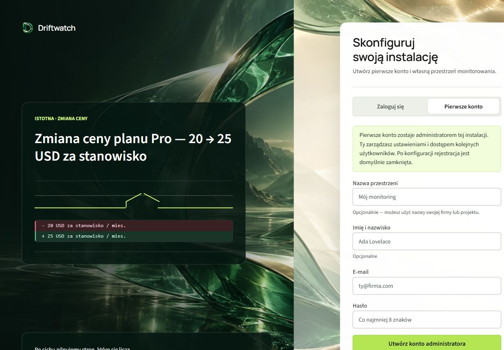

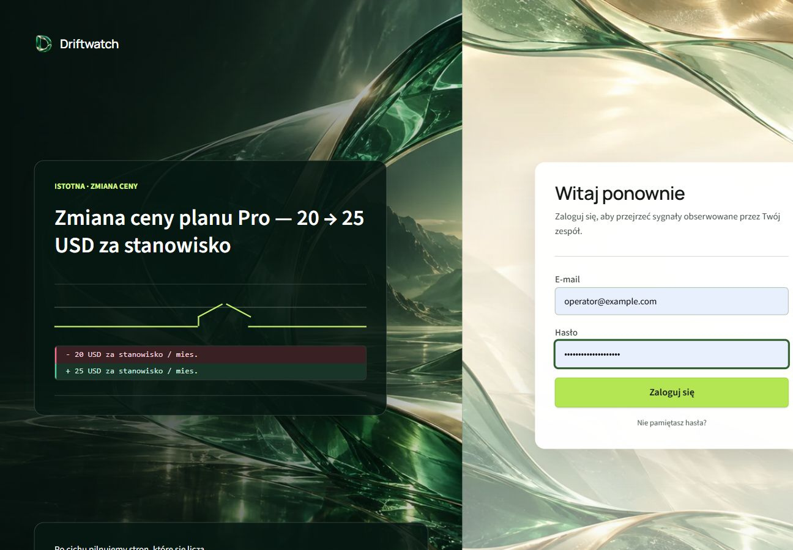

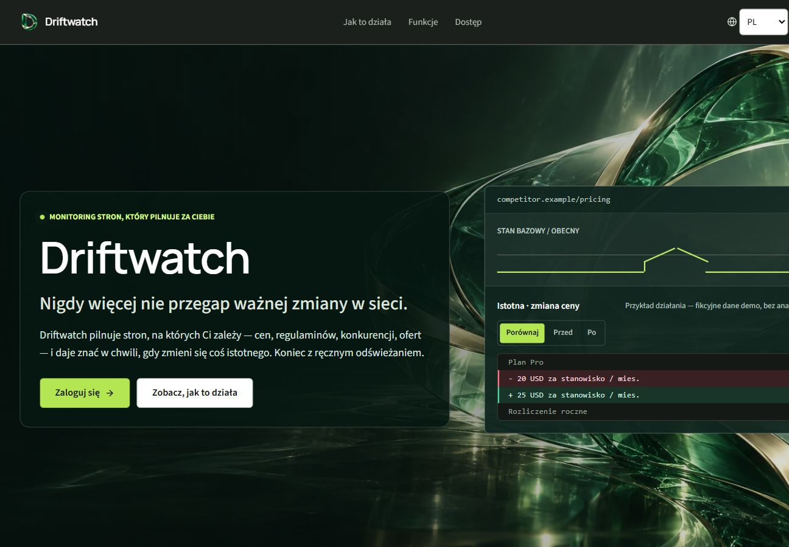

## Monitoring and evidence

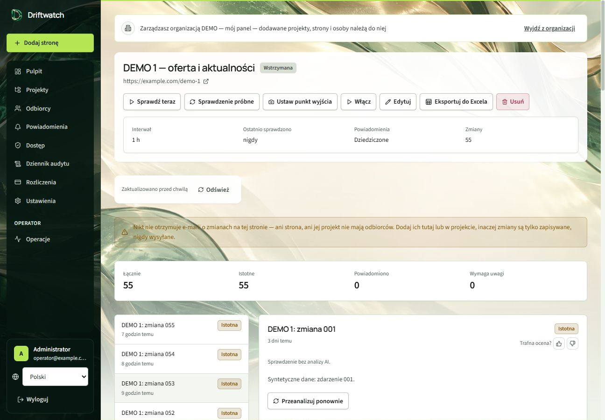

## Responsive views and empty states

| Dashboard | Change history |
|---|---|
| 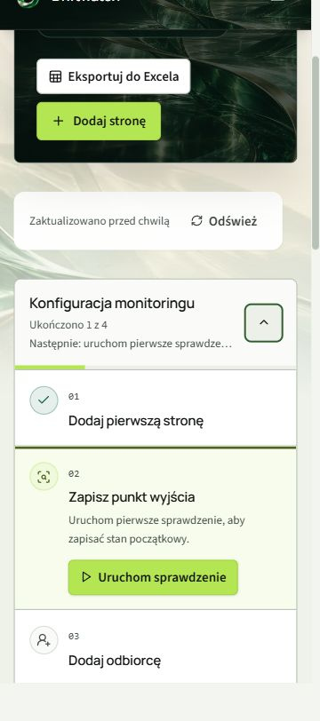 | 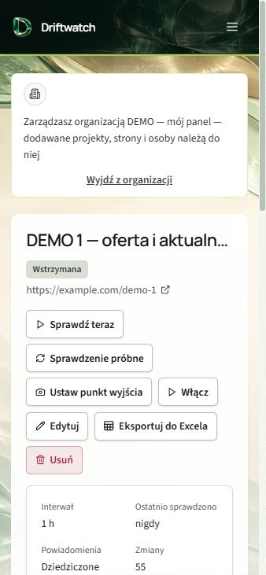 |

| Projects | Recipients |
|---|---|
| 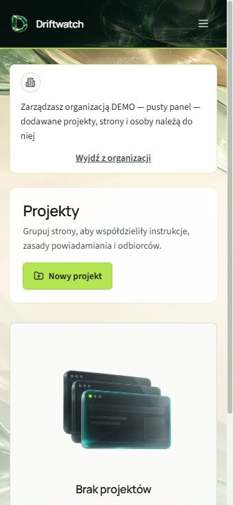 | 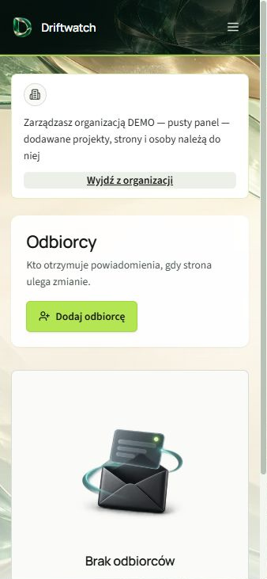 |

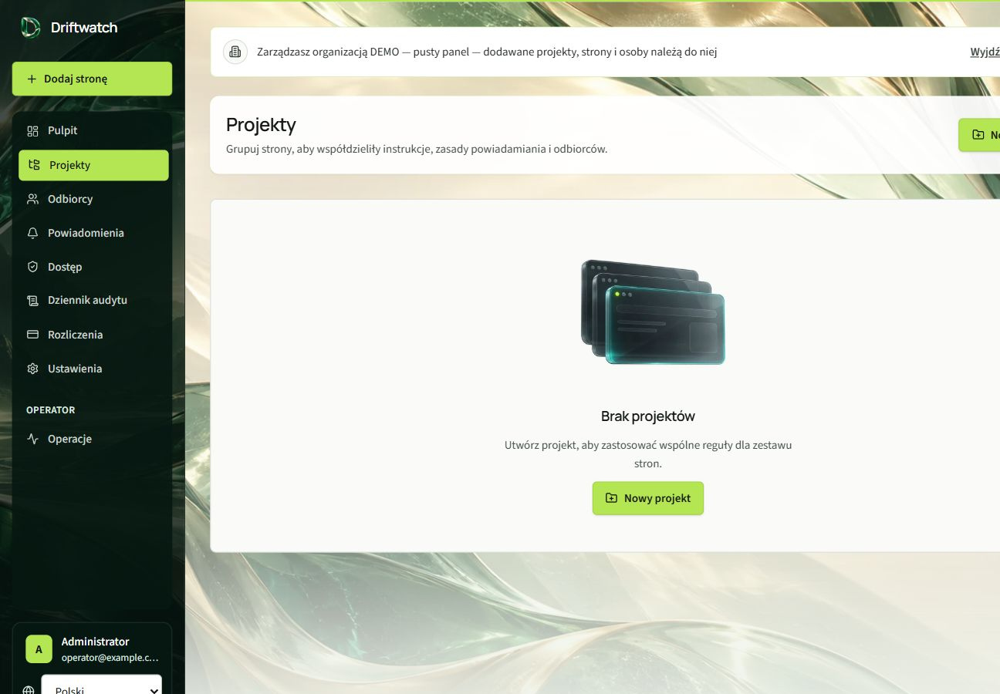

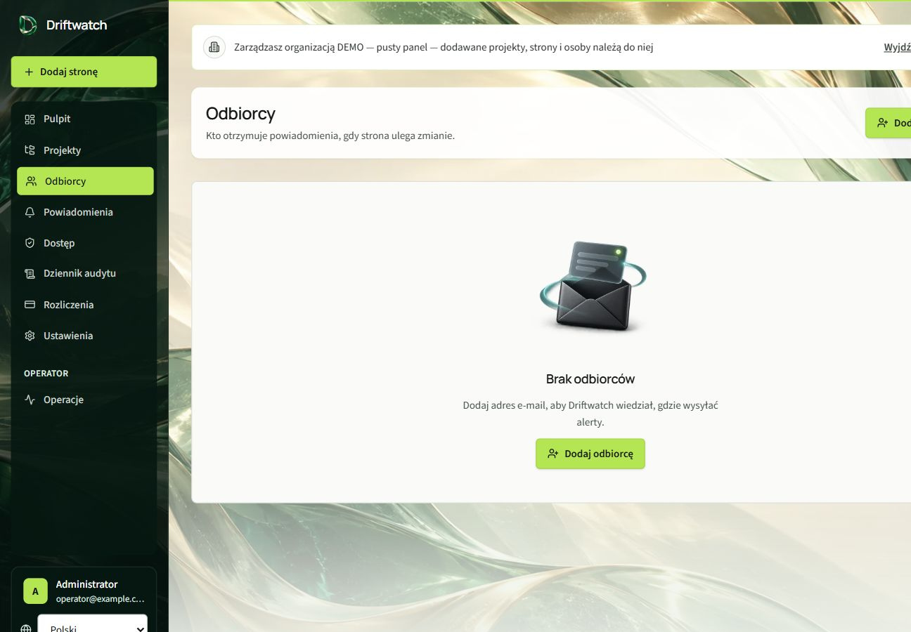

The 320 px view below was separately checked with a classic desktop scrollbar.
Content and document widths match; the manifest records the measured dimensions.

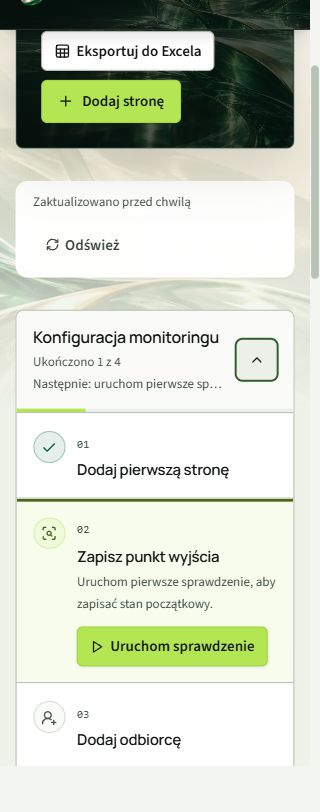

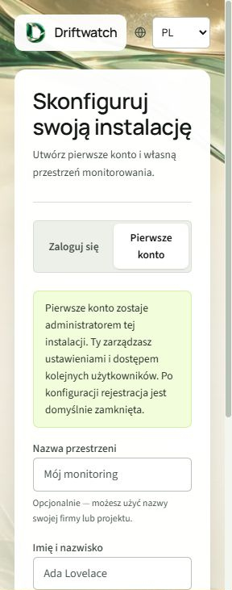

## Access and account recovery

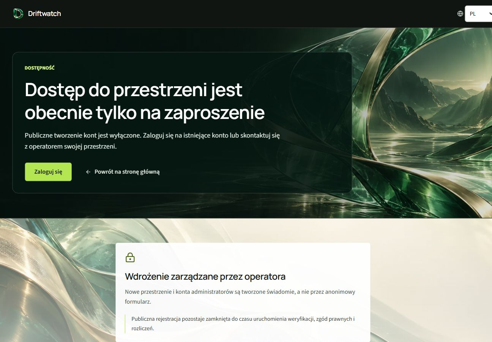

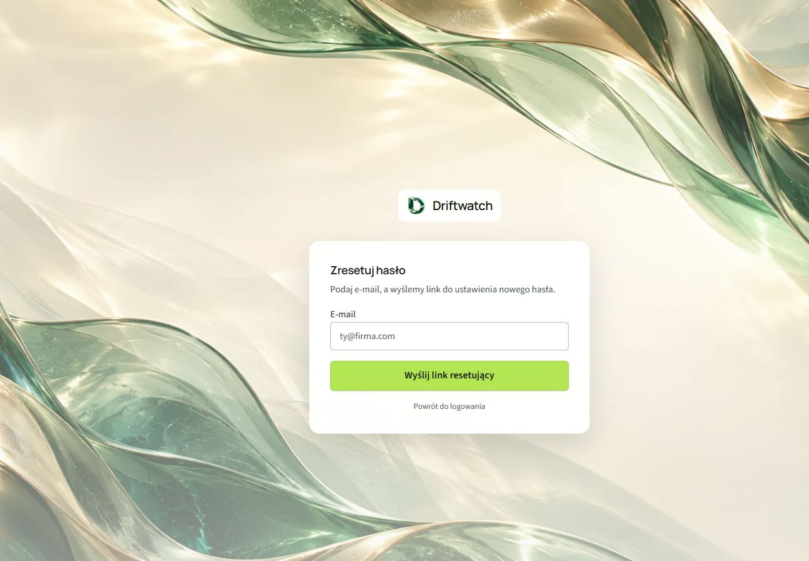
